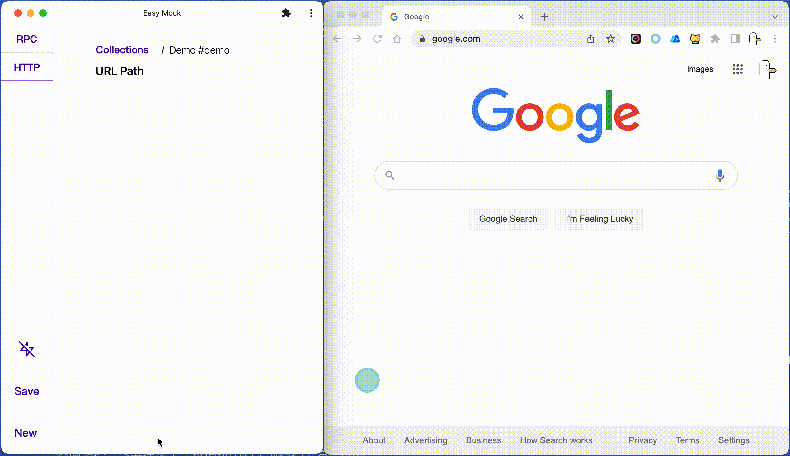

# whistle.easy-mock

A simple mock plugin with ui for [whistle](https://www.npmjs.com/package/whistle)


## Usage

#### Install whistle

```bash
npm i -g whistle
```

#### Install plugin

```bash
npm i -g whistle.easy-mock
# or
w2 install whistle.easy-mock
```

#### Proxy your website

Use tools like [SwitchyOmega](https://chrome.google.com/webstore/detail/proxy-switchyomega/padekgcemlokbadohgkifijomclgjgif?hl=en) to proxy your website to whistle

#### Add rule in whistle's Rules tab

Accept two parameters, separated by '|':

1. (optional) collection_id: select which collection to take effect
2. (optional) host: replace the host of the matched request

```bash
[pattern] easy-mock://[collection_id]|[host]

# if you only want to replace host, still need the '|' separator
[pattern] easy-mock://|host

# for example
www.google.com easy-mock://demo
```

#### Open whistle.easy-mock plugin to start mock (two ways)

1. direct open under whistle's plugin panel
   
2. visit http://localhost:8899/whistle.easy-mock and save as PWA app  
   (replace the 8899 port with your own whistle's real listening port)
   

## Feature

#### Use collections to manage your mock data


#### Mock data by matching in order of preference:

1. The value for `service_method` key in the Query / Request Body
   
2. URL pathname
   

#### Customized [JSON5](https://json5.org/) editor, with comment & javascript object syntax support


#### Support switching mock data for one request


#### Support [Mock.js](http://mockjs.com/) syntax


#### Support encoding/decoding data with JSON.stringify/JSON.parse by adding special prefix `$$`/`$$$`


#### Support setting response delay (0 - 15s)


(Special usage: set delay to > 0 and leave the mock data as an empty object "{}" will delay the real response without replacing the real data)

#### One-click to cache all JSON response


